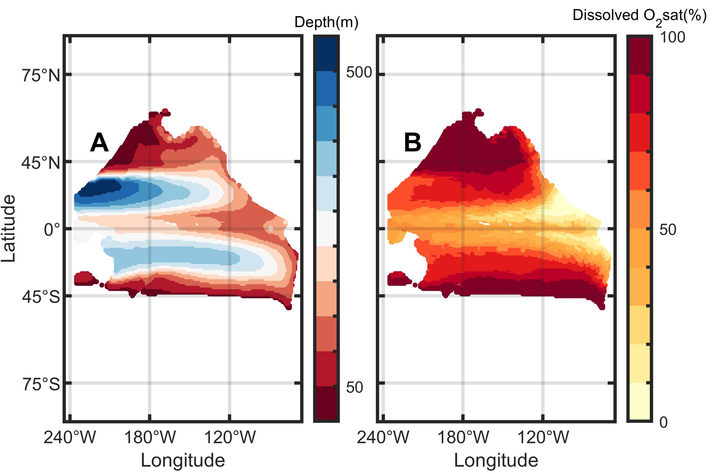

# Isopycnal-surface-of-Pacific-Ocean

1. This file will tell you the depth and the O2sat concentrartion of a specific isopycnal surface in Pacific (or other ocean with different slicing).

2. The code is in Matlab with gsw toolkits (https://github.com/TEOS-10/GSW-Matlab) to help calculating absolute salinity, conservative temperature, specific density (σθ).

3. The data is from WOA 2013 (.nc) files. The data could be found at https://www.nodc.noaa.gov/OC5/woa13/woa13data.html. These data including the annual mean salinity, temperature and oxygen concentration for 1° grid and data dimensions are 360`×`180`×`104. The first dimension (360) is the longtitude from (1°-360°) corresponding to (179°W to 0°W, then 0°E to 180°E), while the second dimension (180) is the latitude from (1-180) corresponding to (89°S to 90°N). The last dimension is the depth related. We have already finished slicing the open ocean part for Paicific ocean especially the part with Northern Pacific gyre and Southern Pacific gyre. You are welcomed to slice your area of interest out. You can find the mean O2 in this specific layer with just some minor modification.  

4. Here is an example of a graph of the products for this model with specific density (σθ=25.8~26.2) in the Pacific ocean.
